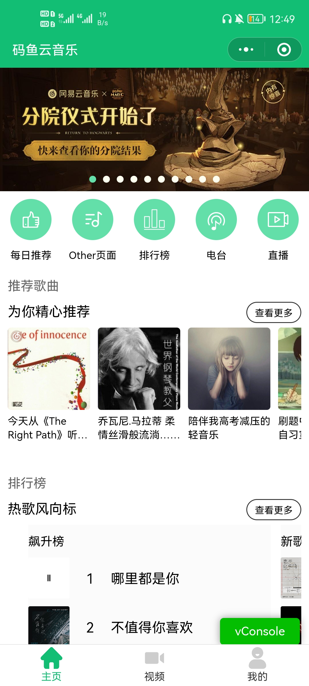
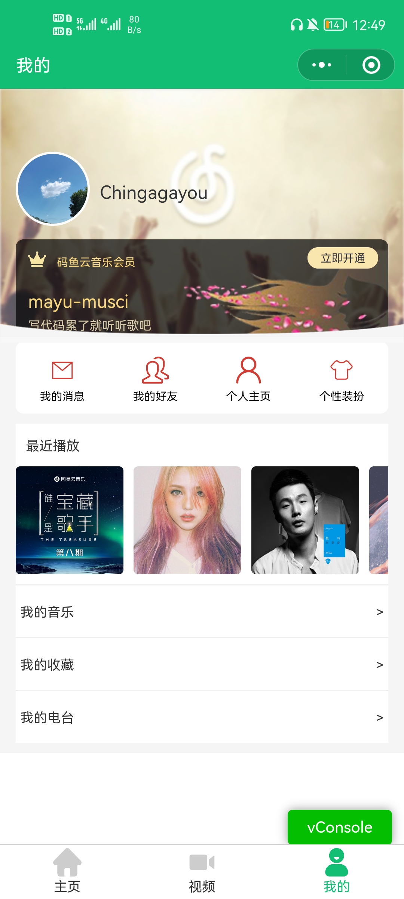
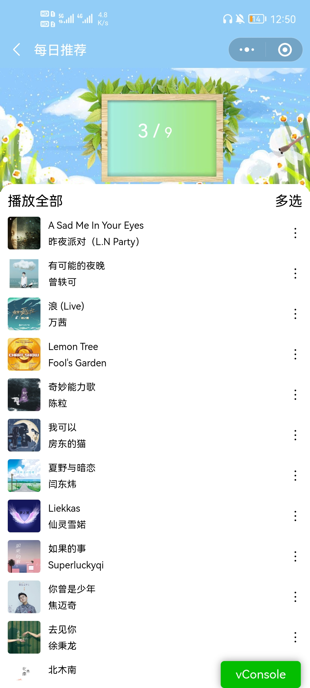
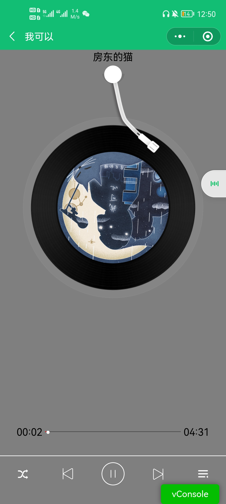
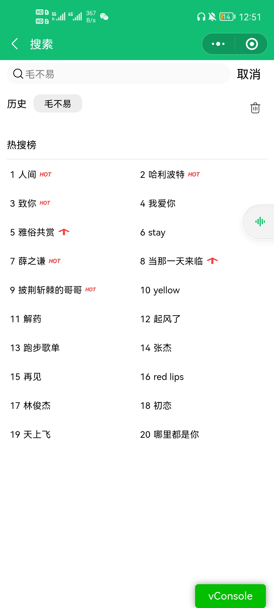
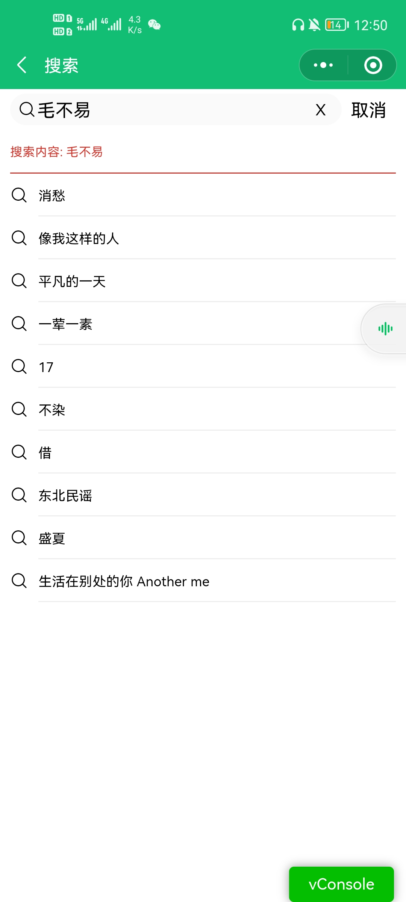

# 小程序 - 码鱼云音乐

> 是网易云音乐(接口), 又或许是QQ音乐(采用QQ音乐主题色)

## 项目说明

### 关于API文档

官方文档地址: https://binaryify.github.io/NeteaseCloudMusicApi/#/

[简易接口文档](./简易接口文档.pdf) ,  可满足本项目需求

### 关于后台API

后端是开源的[网易云音乐node.js版API](https://binaryify.github.io/NeteaseCloudMusicApi/#/)

经测试最新版的API(4.0.20)存在bug, 故推荐大家使用老版本的API即可满足本项目需求

可以选择[mayu_server](./mayu_server), `npm install`安装依赖后执行`node ./app.js`即可在本地开启后端服务,默认端口为3000

也可部署到服务器中,  [零一的博客-部署node.js服务](https://lpyexplore.gitee.io/blog/blogs/tutorial/setUpServer.html#%E5%9B%9B%E3%80%81%E9%85%8D%E7%BD%AE%E6%9C%8D%E5%8A%A1%E5%99%A8%E3%80%81%E7%BD%91%E7%AB%99)

## 项目目录

```
mayu-music
├─ app.js               //全局js
├─ app.json             //全局配置
├─ app.wxss             //全局样式
├─ components           //组件
│  └─ navHeader
├─ miniprogram_npm      //微信开发者工具构建的包
│  ├─ moment            //时间转换包
│  └─ pubsub-js         //页面通信
├─ pages                //页面文件
│  ├─ index             //首页
│  ├─ login             //登录页面
│  ├─ personal          //我的页面
│  ├─ recommengSong     //歌曲推荐
│  ├─ search            //搜索页面
│  ├─ songDetail        //歌曲播放页面
│  └─ video             //视频页面
├─ static               //静态文件
│  ├─ iconfont          //字体图标
│  └─ images            //图片
├─ utils                //工具函数
└─ 总结.md              //知识点总结

```

## 项目截图













